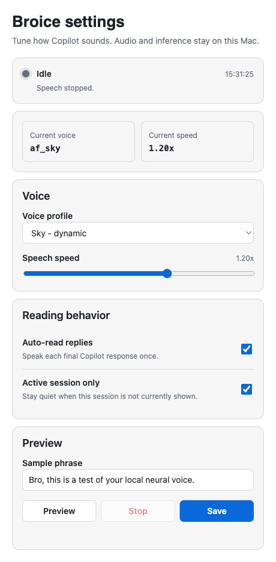

# Broice

**Broice** gives GitHub Copilot a voice — 100% locally, on your own Mac.

It reads Copilot's responses out loud using a local neural text-to-speech model, with an interactive settings panel built right into the Copilot side panel. No API keys, no cloud calls, no telemetry. Audio never leaves your machine.

Broice runs the [Kokoro](https://github.com/thewh1teagle/kokoro-onnx) ONNX model (~82M parameters) under the hood.

## Install with GitHub Copilot

> **Paste this prompt into GitHub Copilot:**
>
> `Install Broice from https://github.com/nerealegui/broice/tree/main`

Copilot installs Broice to `~/.copilot/extensions/broice` and reloads extensions. Because this repository is currently private, you must have access to it before installing.

<p align="center">
  
</p>

---

## Features

| Feature | Description |
|---|---|
| **Fully local** | Neural inference runs on your Mac's CPU / Neural Engine via ONNX Runtime. Nothing is sent anywhere. |
| **Auto-read responses** | Speaks Copilot replies as they arrive, with Markdown cleaned for natural speech. |
| **Settings Canvas** | A native-feeling side panel (GitHub Primer styled) to pick a voice, tune speed, and test audio. |
| **Mid-speech stop** | Cancel playback instantly via button, slash command, or natural language. |
| **Smart speech rules** | Skips emojis, and reads `install.sh` as "install dot sh" instead of two separate words. |
| **Self-bootstrapping** | On first run it creates its own Python venv and downloads model weights automatically. |
| **10 voices** | American and British, male and female. |

---

## How it works

```
┌────────────────────────────────────────────────────────────────────────────────┐
│                          YOUR MAC — EVERYTHING IS LOCAL                        │
│                                                                                │
│  1. GITHUB COPILOT                                                             │
│     ┌──────────────────────────────────────────────────────────┐               │
│     │  Copilot App / CLI runtime                               │               │
│     │  • You send a prompt, Copilot replies                    │               │
│     │  • Emits session event: "assistant.message"              │               │
│     │  • `/voice` opens the settings Canvas                    │               │
│     └───────────────────────────┬──────────────────────────────┘               │
│                                 │ JSON-RPC over stdio                          │
│                                 ▼                                              │
│  2. BROICE EXTENSION  (~/.copilot/extensions/broice/)                          │
│     ┌──────────────────────────────────────────────────────────┐               │
│     │  extension.mjs                                           │               │
│     │  • Bootstraps venv + model weights on first launch       │               │
│     │  • Listens for "assistant.message" → speaks the reply    │               │
│     │  • Cleans Markdown, strips emojis, expands code names    │               │
│     │  • Serves the Canvas UI over a local HTTP server         │               │
│     │  • Tools: speak / stop_speaking / configure_voice        │               │
│     └───────────────────────────┬──────────────────────────────┘               │
│                                 │ spawns Python worker                         │
│                                 ▼                                              │
│  3. SPEECH ENGINE  (bin/)                                                      │
│     ┌──────────────────────────────────────────────────────────┐               │
│     │  speak.py  +  ONNX Runtime (kokoro-onnx)                 │               │
│     │  • kokoro-v1.0.onnx   neural weights   ~310 MB           │               │
│     │  • voices-v1.0.bin    voice embeddings  ~27 MB           │               │
│     │  • renders latest_speech.wav                             │               │
│     │  • SIGTERM handler → instant cancellation                │               │
│     └───────────────────────────┬──────────────────────────────┘               │
│                                 │ audio                                        │
│                                 ▼                                              │
│  4. PLAYBACK                                                                   │
│     ┌──────────────────────────────────────────────────────────┐               │
│     │  macOS `afplay`  ──►  speakers / headphones              │               │
│     └──────────────────────────────────────────────────────────┘               │
└────────────────────────────────────────────────────────────────────────────────┘
```

### Speech flow

```
Copilot reply
     │
     ▼
cleanMarkdownForSpeech()
     │  • code blocks  →  "[code snippet]"
     │  • `install.sh` →  "install dot sh"
     │  • emojis       →  removed
     │  • headings, links, tables, bullets → flattened
     ▼
speak.py  ──►  Kokoro ONNX  ──►  WAV  ──►  afplay  ──►  audio out
     ▲
     └── SIGTERM from stopSpeech() cancels playback immediately
```

### Canvas flow

```
You type /voice
     │
     ▼
onUserPromptSubmitted hook  ──►  open_canvas("broice-voice-settings")
     │
     ▼
Copilot side panel loads  http://127.0.0.1:<port>
     │                          │
     │                          ├─ GET  /api/config       read settings
     │                          ├─ POST /api/config       save to config.json
     │                          ├─ POST /api/test-speech  preview a voice
     │                          └─ POST /api/stop-speech  cancel playback
     ▼
ui/index.html  (GitHub Primer styled, light mode)
```

---

## Requirements

- macOS (uses the built-in `afplay` for audio)
- GitHub Copilot App or Copilot CLI
- Python 3 available as `python3`
- ~400 MB free disk space for the model weights

---

## Setup

### Option 1 — Installer script (recommended)

```bash
git clone <repo-url> broice
cd broice
./install.sh
```

The script copies the extension into `~/.copilot/extensions/broice/`.

### Option 2 — Manual install

```bash
mkdir -p ~/.copilot/extensions/broice
cp -r extension.mjs speak.py config.json ui ~/.copilot/extensions/broice/
```

### Then

1. Reload extensions — in Copilot CLI run `/reload`, or restart the Copilot App.
2. Confirm it loaded. You should see `broice — ready [user]`.
3. On first launch Broice creates its virtualenv and downloads the model weights in the background. This takes a couple of minutes and only happens once.
4. Type `/voice` in chat to open the settings panel.

> **First-run note:** Speech won't work until the bootstrap finishes. Watch for the "Broice setup complete and ready!" log message.

---

## Usage

### Open the settings panel

Type any of these in Copilot chat:

```
/voice     /tts     /voices     voice settings
```

From the panel you can pick a voice, adjust speed from 0.7x to 1.5x, toggle automatic reading, edit and save your sample phrase, preview with **Test**, and cancel with **Stop**.

### Stop speech mid-sentence

| Method | How |
|---|---|
| Slash command | `/stop` · `/quiet` · `/silence` · `/shh` · `/cancel` |
| Panel | Click **Stop** |
| Natural language | "Stop speaking", "Be quiet" |
| Automatic | Sending any new message interrupts the previous speech |

### Control it conversationally

```
"Switch voice to bf_emma"
"Set speed to 1.1"
"Turn off auto-reading"
"Read that back to me"
```

---

## Voices

| Voice ID | Accent | Character |
|---|---|---|
| `af_sarah` | American Female | Warm, natural (default) |
| `af_bella` | American Female | Soft, clear |
| `af_nicole` | American Female | Crisp, professional |
| `af_sky` | American Female | Dynamic |
| `am_adam` | American Male | Deep, articulate |
| `am_michael` | American Male | Friendly, standard |
| `bf_emma` | British Female | Conversational |
| `bf_isabella` | British Female | Formal, articulate |
| `bm_george` | British Male | Classic British |
| `bm_lewis` | British Male | Casual British |

---

## Repository layout

```
broice/
├── extension.mjs        Copilot extension: tools, canvas, hooks, HTTP server
├── speak.py             Python worker: ONNX inference + afplay playback
├── ui/index.html        Settings panel frontend (HTML/CSS/JS, Primer styled)
├── config.json          Persisted settings
├── install.sh           Installer
├── docs/                Screenshots
└── bin/                 Created at runtime — venv + model weights (gitignored)
```

---

## Customizing the panel

The entire frontend lives in a single self-contained file: `ui/index.html`. Edit it, then reopen the canvas in Copilot to see your changes — no build step, no rebuild, no restart of the model.

**HTTP API available to the frontend:**

| Endpoint | Method | Purpose |
|---|---|---|
| `/api/config` | `GET` | Read `{ voice, speed, lang, auto_read, sample_phrase }` |
| `/api/config` | `POST` | Persist settings to `config.json` |
| `/api/test-speech` | `POST` | Synthesize and play `{ text, voice, speed }` |
| `/api/stop-speech` | `POST` | Cancel active playback |

---

## Tools exposed to Copilot

| Tool | Purpose |
|---|---|
| `speak` | Speak arbitrary text with optional voice, speed, and language overrides |
| `stop_speaking` | Immediately cancel any active playback |
| `configure_voice` | Update voice, speed, language, or auto-read setting |

---

## Privacy

Broice makes exactly two network requests, both on first install, both to GitHub Releases, to download the model weights. After that it is fully offline. Your prompts, Copilot's responses, and all generated audio stay on your machine.

---

## Credits

Speech synthesis powered by [kokoro-onnx](https://github.com/thewh1teagle/kokoro-onnx) and the [Kokoro-82M](https://huggingface.co/hexgrad/Kokoro-82M) model.
