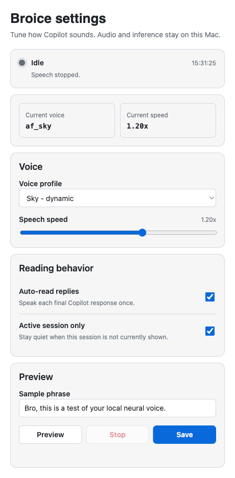

# Broice


**Broice** gives GitHub Copilot a voice — 100% locally, on your own Mac.

It reads Copilot's responses out loud using a local neural text-to-speech model, with an interactive settings panel built right into the Copilot side panel. No API keys, no cloud calls, no telemetry. Audio never leaves your machine.

Broice runs the [Kokoro](https://github.com/thewh1teagle/kokoro-onnx) ONNX model (~82M parameters) by default. This branch also includes an experimental opt-in VibeVoice-Realtime 0.5B backend for testing larger, more expressive local speech generation.

## Install with GitHub Copilot

> **Paste this prompt into GitHub Copilot:**
>
> `Install Broice from https://github.com/nerealegui/broice/tree/main`

Copilot installs Broice to `~/.copilot/extensions/broice` and reloads extensions.

Broice checks its public continuous GitHub Release hourly. Updates download silently,
are checksum-verified, and preserve your settings and downloaded model files. Updated
code becomes active the next time Copilot reloads extensions or restarts.

### Current UI polish

- Added the Broice mascot drawing to the settings header and README branding.
- Served the mascot through the local settings server so the installed panel can load it.
- Made the mascot a compact rounded-square mark.
- Tightened panel padding, card spacing, control heights, and typography while keeping
  the voice controls and audio-reactive status light intact.
- Limited the selectable voice to Sarah for Kokoro and Carter for VibeVoice.

<p align="center">
  
</p>

---

## Features

| Feature | Description |
|---|---|
| **Fully local** | Neural inference runs on your Mac's CPU / Neural Engine via ONNX Runtime. Nothing is sent anywhere. |
| **Auto-read responses** | Speaks each final Copilot reply once the full tool-use loop finishes, but only from the session currently shown. |
| **Live Broice settings** | A theme-aware side panel to configure speech and watch setup, speaking, idle, and error state update live. |
| **Multi-session safe** | Serializes shared environment setup so simultaneous extension processes cannot corrupt the voice runtime. |
| **Mid-speech stop** | Cancel playback instantly via button, slash command, or natural language. |
| **Smart speech rules** | Skips emojis, and reads `install.sh` as "install dot sh" instead of two separate words. |
| **Self-bootstrapping** | On first run it creates its own Python venv and downloads model weights automatically. |
| **10 voices** | American and British, male and female voices across natural, articulate, dynamic, and professional styles. |
| **Experimental VibeVoice** | Optional VibeVoice-Realtime 0.5B engine with separate dependencies and speaker presets. |

---

## How it works

```
┌────────────────────────────────────────────────────────────────────────────────┐
│                          YOUR MAC — EVERYTHING IS LOCAL                        │
│                                                                                │
│  1. GITHUB COPILOT                                                             │
│     ┌──────────────────────────────────────────────────────────┐               │
│     │  Copilot App / CLI runtime                               │               │
│     │  • You send a prompt, Copilot replies                    │               │
│     │  • Emits session event: "assistant.message"              │               │
│     │  • `/voice` opens the settings Canvas                    │               │
│     └───────────────────────────┬──────────────────────────────┘               │
│                                 │ JSON-RPC over stdio                          │
│                                 ▼                                              │
│  2. BROICE EXTENSION  (~/.copilot/extensions/broice/)                          │
│     ┌──────────────────────────────────────────────────────────┐               │
│     │  extension.mjs                                           │               │
│     │  • Bootstraps venv + model weights on first launch       │               │
│     │  • Coordinates setup safely across concurrent sessions   │               │
│     │  • Buffers "assistant.message" until "session.idle"      │               │
│     │  • Cleans Markdown, strips emojis, expands code names    │               │
│     │  • Serves the Canvas UI over a local HTTP server         │               │
│     │  • Tools: speak / stop_speaking / configure_voice        │               │
│     └───────────────────────────┬──────────────────────────────┘               │
│                                 │ spawns Python worker                         │
│                                 ▼                                              │
│  3. SPEECH ENGINE  (bin/)                                                      │
│     ┌──────────────────────────────────────────────────────────┐               │
│     │  speak.py  +  ONNX Runtime (kokoro-onnx)                 │               │
│     │  speak_vibevoice_server.py  +  PyTorch (experimental, persistent) │        │
│     │  • kokoro-v1.0.onnx   neural weights   ~310 MB           │               │
│     │  • voices-v1.0.bin    voice embeddings  ~27 MB           │               │
│     │  • renders latest_speech.wav                             │               │
│     │  • SIGTERM handler → instant cancellation                │               │
│     └───────────────────────────┬──────────────────────────────┘               │
│                                 │ audio                                        │
│                                 ▼                                              │
│  4. PLAYBACK                                                                   │
│     ┌──────────────────────────────────────────────────────────┐               │
│     │  macOS `afplay`  ──►  speakers / headphones              │               │
│     └──────────────────────────────────────────────────────────┘               │
└────────────────────────────────────────────────────────────────────────────────┘
```

### Speech flow

```
Final Copilot reply (after session.idle)
     │
     ▼
cleanMarkdownForSpeech()
     │  • code blocks  →  "[code snippet]"
     │  • `install.sh` →  "install dot sh"
     │  • emojis       →  removed
     │  • headings, links, tables, bullets → flattened
     ▼
speak.py  ──►  Kokoro ONNX  ──►  WAV  ──►  afplay  ──►  audio out
     ▲
     └── SIGTERM from stopSpeech() cancels playback immediately
```

### Canvas flow

```
You type /voice
     │
     ▼
registered command handler  ──►  session.rpc.canvas.open("broice-voice-settings")
     │
     ▼
Copilot side panel loads  http://127.0.0.1:<port>
     │                          │
     │                          ├─ GET  /api/state        settings + runtime state
     │                          ├─ GET  /api/events       live server-sent events
     │                          ├─ POST /api/config       validate and save settings
     │                          ├─ POST /api/test-speech  preview a voice
     │                          └─ POST /api/stop-speech  cancel playback
     ▼
ui/index.html  (host theme tokens, light and dark modes)
```

---

## Requirements

- macOS (uses the built-in `afplay` for audio)
- GitHub Copilot App or Copilot CLI
- Python 3.10–3.13 (Broice automatically selects a compatible `python3.x` executable)
- ~400 MB free disk space for the model weights

---

## Setup

### Option 1 — Installer script (recommended)

```bash
git clone <repo-url> broice
cd broice
./install.sh
```

The script copies the extension into `~/.copilot/extensions/broice/`.

### Option 2 — Manual install

```bash
mkdir -p ~/.copilot/extensions/broice
cp extension.mjs auto-updater.mjs active-session.mjs \
  speech-response-batcher.mjs speak.py config.json \
  copilot-extension.json ~/.copilot/extensions/broice/
cp -R ui skills ~/.copilot/extensions/broice/
```

### Then

1. Reload extensions — in Copilot CLI run `/reload`, or restart the Copilot App.
2. Confirm it loaded. You should see `broice — ready [user]`.
3. On first launch Broice creates its virtualenv and downloads the model weights in the background. This takes a couple of minutes and only happens once.
4. Type `/voice` in chat to open the settings panel.

> **First-run note:** Speech won't work until the bootstrap finishes. Watch for the "Broice setup complete and ready!" log message.

---

## Usage

### Open the settings panel

Broice registers commands with Copilot, including descriptions in slash-command
autocomplete:

| Command | Behavior |
|---|---|
| `/voice` | Opens or focuses the live voice settings panel directly. |
| `/speak <text>` | Speaks the supplied text once without generating an assistant reply or duplicate auto-read. |
| `/stop` | Stops playback and suppresses any pending auto-read. |

Copilot's terminal TUI runs these as native SDK client commands. The desktop app
currently filters client commands from its composer, so Broice also installs
user-invocable skill adapters with the same names. This keeps all three entries
discoverable in desktop slash autocomplete while preserving direct command
execution in the terminal.

The conversational shortcuts `/tts`, `/voices`, `voice settings`, `/quiet`,
`/silence`, `/shh`, and `/cancel` remain available. From the settings panel you can
pick a voice, adjust speed from 0.7x to 1.5x, toggle automatic reading, restrict
speech to the session currently shown, edit and save your sample phrase, preview
audio, and cancel playback. Its setup, speaking, idle, and error state updates
without refreshing.

By default, Broice checks Copilot's foreground session before starting playback and while audio is playing. When the host exposes foreground-session information, replies from background sessions are skipped and switching away from a speaking session stops its audio. Hosts that do not expose this information continue playing audio rather than suppressing every response.

### Experimental VibeVoice engine

Open `/voice`, choose **VibeVoice Realtime 0.5B (experimental)**, and save.
Broice keeps Kokoro as the default. VibeVoice dependencies are installed only
when that engine is selected, and its model plus the selected official speaker
preset are downloaded lazily the first time the engine is enabled.

Because VibeVoice's PyTorch model takes roughly 13 seconds to import and load
(versus Kokoro's near-instant ONNX load), Broice runs it in a **persistent
background worker** instead of reloading it per utterance. Selecting the
engine warms the worker once, then keeps it resident for 10 minutes of
inactivity before shutting down automatically to free memory and reloading on
the next request. VibeVoice generation is played from a complete WAV file for
reliable, gap-free output; the experimental chunk-streaming API is not used
because it can truncate or introduce audible gaps on some local systems.
Switching back to Kokoro shuts the worker down immediately.

Cancelling speech while VibeVoice is actively generating (before playback has
started) terminates the worker outright, since there is no way to interrupt
generation mid-flight; the next request pays the ~13 second reload cost again.
Cancelling once VibeVoice has started playing audio is instant, same as Kokoro.

VibeVoice is intended for local experimentation rather than a production
default: it is larger, slower to initialize, and less mature than Kokoro.

### Stop speech mid-sentence

| Method | How |
|---|---|
| Slash command | `/stop` (registered) · `/quiet` · `/silence` · `/shh` · `/cancel` |
| Panel | Click **Stop** |
| Natural language | "Stop speaking", "Be quiet" |
| Automatic | Sending any new message interrupts the previous speech |

### Control it conversationally

```
"Switch voice to bf_emma"
"Set speed to 1.1"
"Turn off auto-reading"
"Read that back to me"
```

---

## Voices

| Voice ID | Accent & Gender | Character / Style |
|---|---|---|
| `af_sarah` | American Female | Warm, natural (default) |
| `af_bella` | American Female | Soft, clear |
| `af_nicole` | American Female | Crisp, professional |
| `af_sky` | American Female | Dynamic |
| `am_adam` | American Male | Deep, articulate |
| `am_michael` | American Male | Friendly, standard |
| `bf_emma` | British Female | Conversational |
| `bf_isabella` | British Female | Formal, articulate |
| `bm_george` | British Male | Classic British |
| `bm_lewis` | British Male | Casual British |

---

## Repository layout

```
broice/
├── extension.mjs        Copilot extension: tools, canvas, hooks, HTTP server
├── active-session.mjs   Foreground session detection
├── speech-response-batcher.mjs
│                        Holds the final reply until the session becomes idle
├── auto-updater.mjs     Checks and installs continuous release updates
├── skills/              Desktop slash-palette adapters for voice/speak/stop
├── speak.py             Python worker: ONNX inference + afplay playback
├── ui/index.html        Settings panel frontend (HTML/CSS/JS, Primer styled)
├── config.json          Persisted settings
├── install.sh           Installer
├── docs/                Screenshots
└── bin/                 Created at runtime — venv + model weights (gitignored)
```

---

## Customizing the panel

The entire frontend lives in a single self-contained file: `ui/index.html`. Edit it, then reopen the canvas in Copilot to see your changes — no build step, no rebuild, no restart of the model.

**HTTP API available to the frontend:**

| Endpoint | Method | Purpose |
|---|---|---|
| `/api/state` | `GET` | Read settings plus live setup/playback status |
| `/api/events` | `GET` | Subscribe to status and configuration updates with SSE |
| `/api/config` | `GET` | Read `{ voice, speed, lang, auto_read, active_session_only, sample_phrase }` |
| `/api/config` | `POST` | Validate and persist settings to `config.json` |
| `/api/test-speech` | `POST` | Synthesize and play `{ text, voice, speed }` |
| `/api/stop-speech` | `POST` | Cancel active playback |

---

## Canvas actions

The `broice-voice-settings` canvas exposes agent-callable actions:

| Action | Purpose |
|---|---|
| `get_state` | Read current setup, playback, and configuration state |
| `update_settings` | Validate and update voice settings |
| `preview` | Speak preview text with optional voice and speed overrides |
| `stop` | Stop playback and suppress pending auto-read |

---

## Tools exposed to Copilot

| Tool | Purpose |
|---|---|
| `speak` | Speak arbitrary text with optional voice, speed, and language overrides |
| `stop_speaking` | Immediately cancel any active playback |
| `configure_voice` | Update voice, speed, language, or auto-read setting |

---

## Privacy

Broice downloads its model and voice data from GitHub Releases during first-time setup. It
also checks the public Broice release manifest hourly and downloads an update package only
when `main` has changed. Your prompts, Copilot responses, settings, model data, and generated
audio stay on your machine.

---

## Credits

Speech synthesis powered by [kokoro-onnx](https://github.com/thewh1teagle/kokoro-onnx) and the [Kokoro-82M](https://huggingface.co/hexgrad/Kokoro-82M) model.
